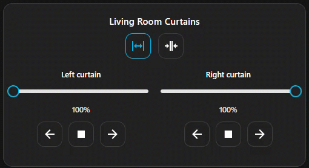

# Double Curtain Card

A dual-cover Lovelace card with **sliders**, **door presets**, **per-side invert**, and clean **% display**.  
Built for Home Assistant dashboards (frontend plugin).




---

## Features
- Smooth **dragging** with **rounded %**; the service call is sent **on release**
- **Door buttons** (optional per side; target position in %)
- **Invert** per side (swap open/close logic for that cover)
- **Blink/animation** is correct even when inverted
- **GUI editor** (ha-form) – entity pickers, toggles, and number inputs
- Always **two columns** (left/right) side-by-side

---

## Requirements
- Home Assistant **2023.12** or newer
- Two `cover.*` entities exposing `current_position` (0–100)

---

## Installation

### Option A — HACS (Custom repository)
1. In Home Assistant open **HACS → ⋯ → Custom repositories**  
2. Add github.com/Hugo0485/DoubleCurtainCard and select type **Dashboard / Plugin**  
3. Open the repo in HACS and click **Install**  
4. The resource will be added automatically as:
   ```yaml
   url: /hacsfiles/double-curtain-card/double-curtain-card.js
   type: module
   ```
   

   ### B) Manual
1. Download dist/double-curtain-card.js (from a release or the repo)
2. Copy it to /config/www/
3. Add a dashboard resource (Settings → Dashboards → Resources):
   ```yaml
   url: /local/double-curtain-card.js?v=1.3.2
   type: JavaScript
   ```

  


